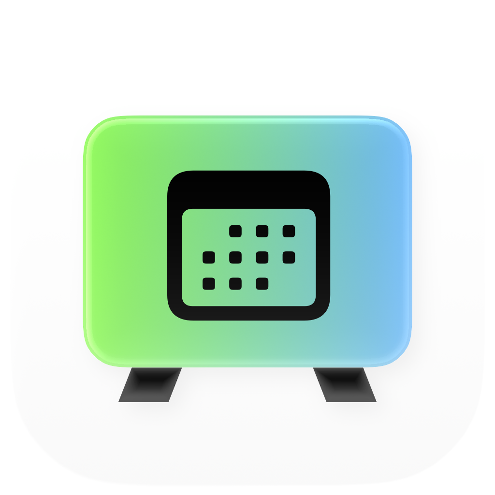

<br><div align="center"> </div> <br>

# Wapacal


Turn your calendar into a Mac desktop wallpaper. Wapacal combines ICS calendar subscriptions, including TimeEdit and Moodle feeds, into a month view or a custom date range.

- Choose which events appear and adjust the layout.
- Export PNGs or a HEIC wallpaper that switches between light and dark with macOS.
- Refresh calendars and update your wallpaper automatically while the app runs.
- Restore your previous wallpaper from Settings.

Wapacal is an early macOS app built from source. It is not notarized for distribution.

Note from maker: <br>
I wanted a calendar desktop wallpaper that updates automatically, so I made it. The project was largely slopped together and I don't have experience maintaining something open source, but I expect to update the app until it has all features I'd want or fix it when it breaks. Feel free to reach out, suggest something or fork the project.

## Build and run

You need macOS, Xcode Command Line Tools, and Node.js 22.14 or newer. The built app targets macOS 13 and later and runs without Node.

From the project directory:

```sh
npm ci
npm run build:native
open output/Wapacal.app
```

The default build includes no private calendars or settings. On first launch, add an ICS subscription URL in **Settings → Calendars**. Existing installations keep their saved settings.

## Make your wallpaper

Choose **Month** or **Module** in the sidebar. A module is a named date range, such as a course block. Use **Choose events** to hide individual events and **Appearance** to adjust the image size, theme, and layout.

Click **Apply wallpaper** to use it on the selected display, or **Export** to save an image. Settings also offers automatic updates and launch at login. Closing the window keeps Wapacal running in the menu bar; choose **Quit** there to stop it.

Your settings and cached calendars stay on your Mac under `~/Library/Application Support/local.wapacal.app/`.

## Current limits

- Wallpapers show Monday through Friday, with a maximum range of 12 weeks.
- Feeds must use UTC times or all-day dates. Recurring events, recurrence exceptions, duplicate event IDs within a feed, and floating or named-zone times are not supported and cause the feed to be rejected.
- External displays, inactive Spaces, and older macOS versions still need live testing. Restoring Apple's dynamic or aerial wallpaper settings is not guaranteed. Future setting to 'apply to all screens'?
- bygone events can disappear from the wallpaper if the feed doesn't serve it anymore
- you need a link to the calendar feed atm, apple/google calendar intergration would make a lot of sense

## Development

```sh
npm run format:check
npm run test:all
```

Build the app before running all tests. Native UI and HEIC tests need a logged-in macOS graphical session. Tests use fictional calendar fixtures.

See the [development guide](docs/development.md) for private builds, the Firefox preview, and command-line tools, or the [architecture guide](docs/native-interface.md) for how the app works.

## License

Copyright (C) 2026 Samuel Kremer. Wapacal is licensed under the [GNU General Public License version 3](LICENSE), GPL-3.0-only. Third-party dependencies retain their own licenses.
