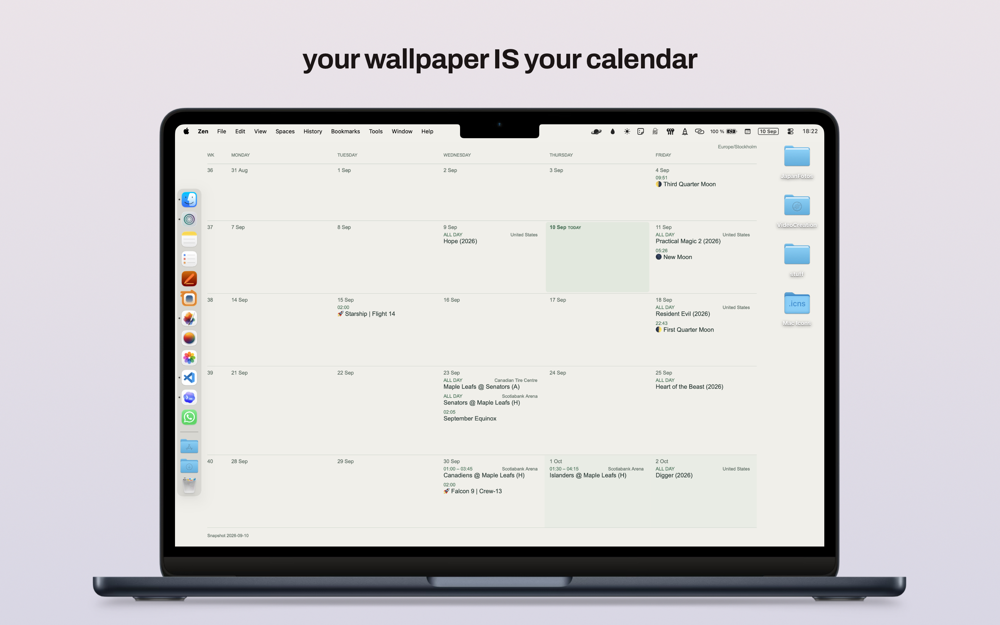
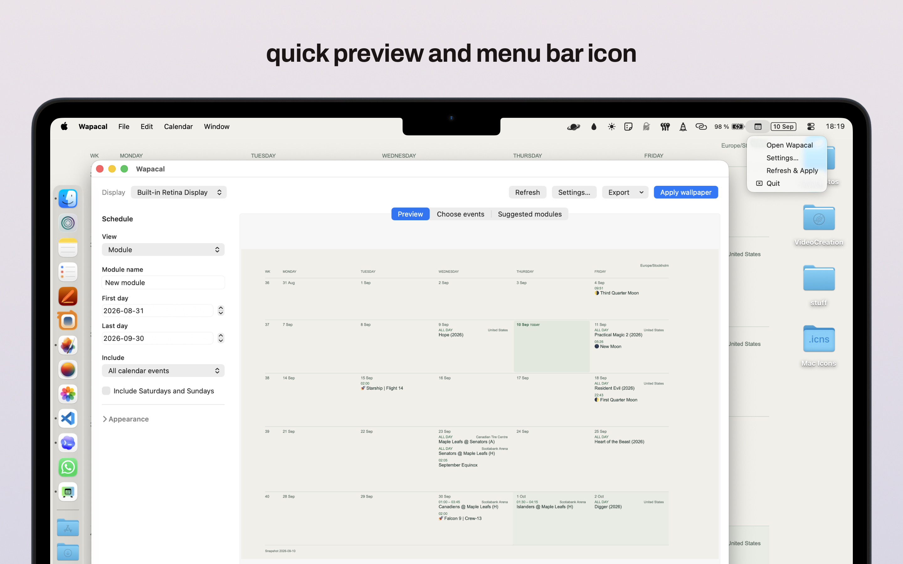

<br><div align="center"> </div> <br>

# Wapacal


Turn your calendar into a Mac desktop wallpaper. Wapacal combines ICS calendar subscriptions, including TimeEdit and Moodle feeds, into a month view or a custom date range.

- Choose which events appear and adjust the layout.
- Export PNGs or a HEIC wallpaper that switches between light and dark with macOS.
- Refresh calendars and update your wallpaper automatically while the app runs.
- Restore your previous wallpaper from Settings.

<p class="showcase" align="center">
  
</p>

Wapacal is an early macOS app built from source.

Wapacal is not currently notarized. If downloadable builds are added, macOS may block the first launch. Open **System Settings → Privacy & Security** and choose **Open Anyway**.

### Note from maker:
I wanted a calendar desktop wallpaper that updates automatically, so I made it. The project was largely slopped together and I don't have experience maintaining something open source, but I expect to update the app until it has all features I'd want or fix it when it breaks. Feel free to reach out, suggest something or fork the project.

## Build and run

You need macOS, Xcode Command Line Tools, and Node.js 22.14 or newer. The built app targets macOS 13 and later and runs without Node.

From the project directory:

```sh
npm ci
npm run build:native
open output/Wapacal.app
```

The default build includes no private calendars or settings. On first launch, add an ICS subscription URL in **Settings → Calendars**. Existing installations keep their saved settings.

## Make your wallpaper

Choose **Month** or **Module** in the sidebar. A module is a named date range, such as a course block. Enable **Include Saturdays and Sundays** when you want a seven-day calendar. Use **Choose events** to hide individual events and **Appearance** to adjust the image size, theme, and layout.

In **Settings → Calendars**, choose an **Event color** for each subscription. Changes save and update the preview immediately. Preset colors adjust for light and dark appearance; **Custom** opens the color picker to choose an exact color for both. The wallpaper footer lists included calendars in their colors. Click **Apply wallpaper** to update your desktop, or enable automatic updates. Choose **Default** to use the standard theme colors.

Click **Apply wallpaper** to use it on the selected display, or **Export** to save an image. Settings also offers automatic updates and launch at login. Closing the window keeps Wapacal running in the menu bar; choose **Quit** there to stop it.

From the menu bar, you can reopen Wapacal, change settings, refresh and apply the wallpaper, or quit the app.

<p align="center">
  
</p>

Your settings and cached calendars stay on your Mac under `~/Library/Application Support/com.samuelkremer.wapacal/`.

## Current limits

- Feeds support UTC times, all-day dates, named time zones, and floating times interpreted in the wallpaper's time zone. Repeating events, added/excluded dates, and individually moved or cancelled occurrences are supported. Identical duplicate records are ignored.
- Conflicting records with the same event and occurrence ID, unknown time zones without a `VTIMEZONE` definition, `RANGE=THISANDFUTURE` exceptions, and `RDATE` periods still cause the feed to be rejected. Recurrence expansion covers the selected view and nearby years, with limits of 20,000 events and 50,000 recurrence steps per feed.
- External displays, inactive Spaces, and older macOS versions still need live testing. Restoring Apple's dynamic or aerial wallpaper settings is not guaranteed.
- Wapacal currently requires a direct ICS subscription URL. It does not connect directly to Apple Calendar or Google Calendar accounts.

## Development

```sh
npm run format:check
npm run test:all
```

Build the app before running all tests. Native UI and HEIC tests need a logged-in macOS graphical session. Tests use fictional calendar fixtures.

See the [development guide](docs/development.md) for private builds, the Firefox preview, and command-line tools, or the [architecture guide](docs/native-interface.md) for how the app works.

## License

Copyright (C) 2026 Samuel Kremer. Wapacal is licensed under the [GNU General Public License version 3](LICENSE), GPL-3.0-only. Third-party dependencies retain their own licenses.
